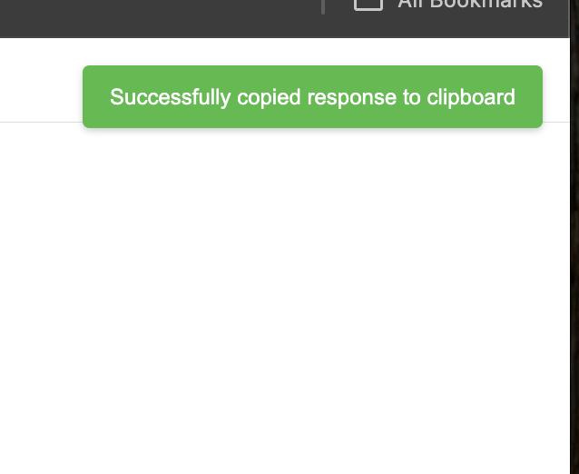

# 

    
    <H1>Web2Md Chrome Extension</H1>

 Get markdown from any webpage with a single keyboard shortcut.

## Installation

Follow [these steps](https://developer.chrome.com/docs/extensions/get-started/tutorial/hello-world#load-unpacked) to load an unpacked extension.  Select the root of this repository as the extension directory.

## Usage

1. Open a webpage
2. Press `Ctrl+Shift+O` (or `Cmd+Shift+O` on macOS) to trigger the extension
3. The contents of the page will be converted to markdown and copied to your clipboard

You will get a notification in the upper right corner of the screen that looks like this:

## Changing The Keyboard Shortcut

To change the keyboard shortcut, open Chrome's extensions page, click on the "Manage" button for this extension, click on "Keyboard shortcuts", and change the shortcut from "Ctrl+Shift+O" to whatever you'd like.

You can also modify the `manifest.json` file to change the shortcut.  Look for the `commands` section.